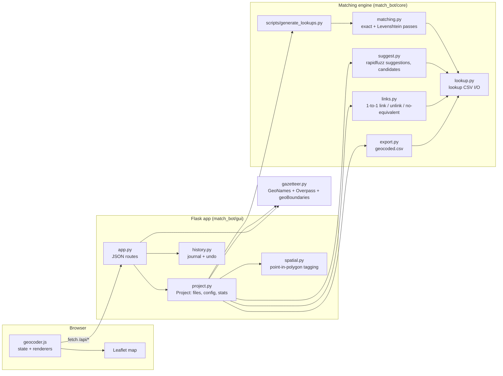
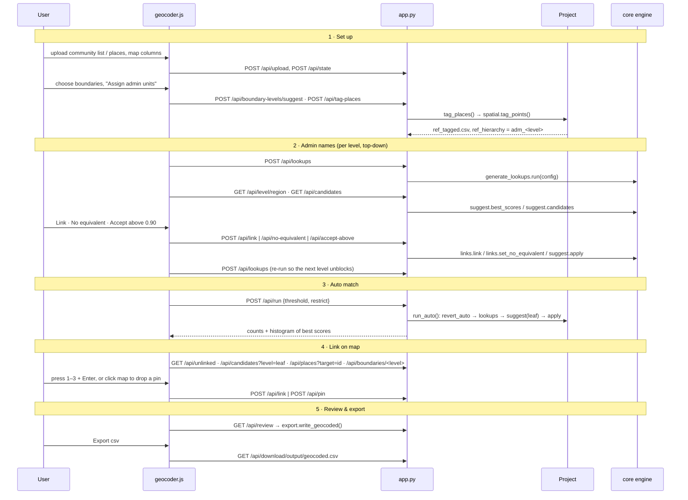
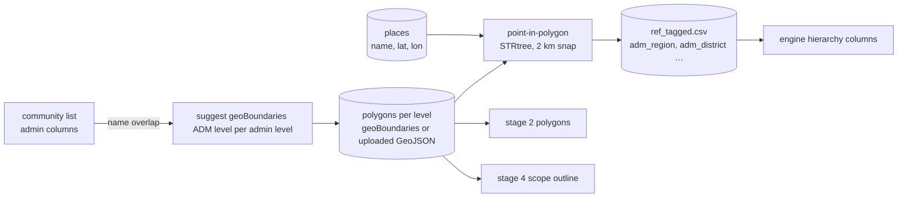

# Community Geocoder — technical architecture

The Community Geocoder is the Match-Bot GUI: a single-page web app that walks
a list of community names through five stages until each has coordinates. It
is a thin orchestration layer over the existing Match-Bot matching engine; the
GUI never scores a name itself.

## Stack

| Layer | Technology | Notes |
|---|---|---|
| Matching engine | Python 3.9+, pandas, scipy, jellyfish, rapidfuzz | `match_bot/core`, unchanged CLI (`python -m match_bot lookups\|suggest`) |
| Spatial | shapely (STRtree) | point-in-polygon tagging of places; boundaries from geoBoundaries or user GeoJSON |
| Web server | Flask 3 | one process, JSON API, per-browser session directory |
| Front end | Vanilla JavaScript, HTML, CSS; Leaflet 1.9 | no build step, no framework; OpenStreetMap tiles (greyscale filter) |
| External data | GeoNames, geoBoundaries, OpenStreetMap (Overpass) | fetched on demand and cached under `gazetteer/data/` |
| Tests | pytest, Flask test client | fixture project with deliberate typos; Playwright driver used for visual checks |

Everything runs locally. The browser only needs the local server plus CDN
access for Leaflet, the IBM Plex Mono font and map tiles.

## Components



**Responsibilities**

- `geocoder.js` holds one state object `S`, re-renders the active stage into
  `#pane`, and keeps a single Leaflet instance alive underneath stages 2 and 4.
  Actions are delegated through `data-act` attributes; every mutating call
  returns the full project state so the page never drifts from disk.
- `app.py` maps HTTP routes to `Project` methods and journals every mutation
  with its inverse operation.
- `project.py` owns one session directory: uploads, form state, the
  `MatcherConfig` it builds for the engine, per-level statistics, candidate
  lookups, pins, histogram, review rows.
- `core/*` is the engine. `suggest.py`, `links.py` and `export.py` were
  extracted from the CLI so the GUI and the command line share one code path.

## Data on disk

One directory per browser session under `match_bot/gui/instance/uploads/<sid>/`:

```
target.csv                community list (+ _row_id)
ref.csv                   named places as uploaded or built
ref_tagged.csv            places + adm_<level> columns from the boundaries  ← what the engine reads
boundaries_<level>.geojson   user-uploaded polygons (geoBoundaries files live in gazetteer/data/)
form_state.json           column mapping, boundary choices, threshold, ui snapshot
output/lookups/<level>_lookup.csv   admin-name crosswalk per level
output/lookups/leaf_lookup.csv      one row per community + one per unused place
output/manual_geocode.csv           dropped pins (target_id, latitude, longitude)
output/history.jsonl                action journal with inverse ops
output/geocoded.csv                 export
```

The lookup CSVs are the single source of truth for matches. `match_type`
values: `exact`, `fuzzy_dist`, `fuzzy_score` (engine passes), `manual`
(a person or a bulk suggestion; `mapping_rationale` says which:
`auto: suggest score=NN` vs `manual: picked score=NN`), `no_equivalent`
(a person decided there is no counterpart), `no_candidate` (still open),
`reference_only` (a place nobody has claimed). Linking is strictly 1-to-1:
a claimed place's `reference_only` row is removed and restored on unlink.

## The five stages and what they call



### How the admin levels are harmonized

Each hierarchy level is the same loop: the engine's exact pass fills the level's
lookup table; the GUI lists the target names still `no_candidate`, scores every
unmatched reference name in the same parent group with rapidfuzz
(`max(ratio, token_set_ratio)`, standalone digits stripped), and the person
links, rejects, or bulk-accepts. Because the engine applies the crosswalk
before matching, re-running lookups after a level is settled unblocks the
children, exactly as the CLI walkthrough in `projects/ICR Examples/CIV_example.md`.

### Where the admin units come from

Boundaries are the source of truth, not the places CSV:



The same polygon names feed the engine, the stage 2 map and the stage 4
outline, so the highlighted area is always exactly the candidate pool.

## Undo model

Every mutating route appends `{time, text, inverse}` to `history.jsonl`.
The inverse is an operation the project layer can replay (`unlink` for a
link, `link` back to the previous place for a re-link, `unlink_many` for a bulk
accept, `unpin` for a pin, a `multi` step list for compound actions). Undo pops
the newest entry that still carries an inverse, applies it, and logs the undo.
Engine runs (`lookups`, `run`) are logged but not undoable; they regenerate
files from the lookups, which already preserve every manual decision.

## API summary

| Route | Purpose |
|---|---|
| `GET/POST /api/state`, `POST /api/reset` | form + stats snapshot; new project |
| `POST /api/upload` (`role=target\|ref\|boundaries`) | store CSV / GeoJSON |
| `POST /api/boundary-levels`, `/suggest`, `GET /api/boundaries/<level>` | boundary choice and polygons |
| `POST /api/tag-places` | spatial admin assignment |
| `POST /api/lookups`, `POST /api/run`, `GET /api/histogram` | engine passes |
| `GET /api/level/<level>`, `GET /api/candidates`, `GET /api/unlinked`, `GET /api/places` | stage data |
| `POST /api/link`, `/unlink`, `/no-equivalent`, `/accept-above`, `/pin`, `/unpin` | decisions (journaled) |
| `POST /api/undo`, `GET /api/history` | journal |
| `GET /api/review`, `GET /api/download/<path>` | export |
| `/api/gazetteer/*` | build named places from GeoNames + OSM |

## Testing

- `tests/conftest.py` writes a two-level fixture project (regions, districts,
  communities with typos); `test_suggest.py`, `test_links.py`, `test_export.py`
  cover the engine additions and `test_api_workflow.py` drives the whole
  five-stage flow through the Flask test client, including boundary tagging
  and undo.
- The CLI regression is the CIV example: `lookups` → `suggest --level region
  --apply` → `lookups` → `suggest --level district --apply` → `lookups` must
  still report 457, 557 and 608 matches.
- A Playwright script walks the real page with the CIV files and screenshots
  each stage for visual review.
